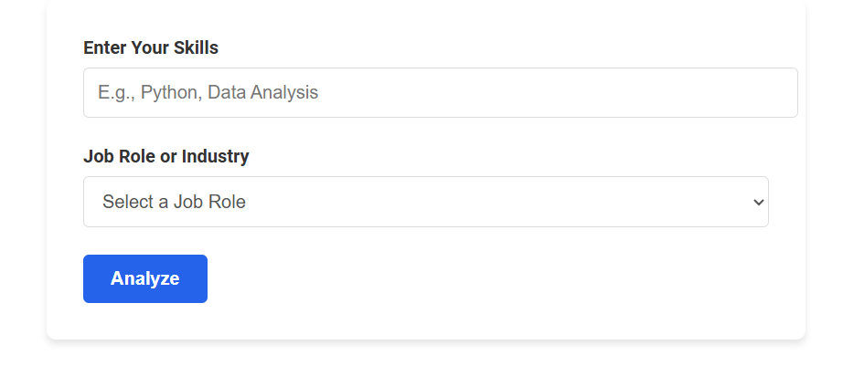
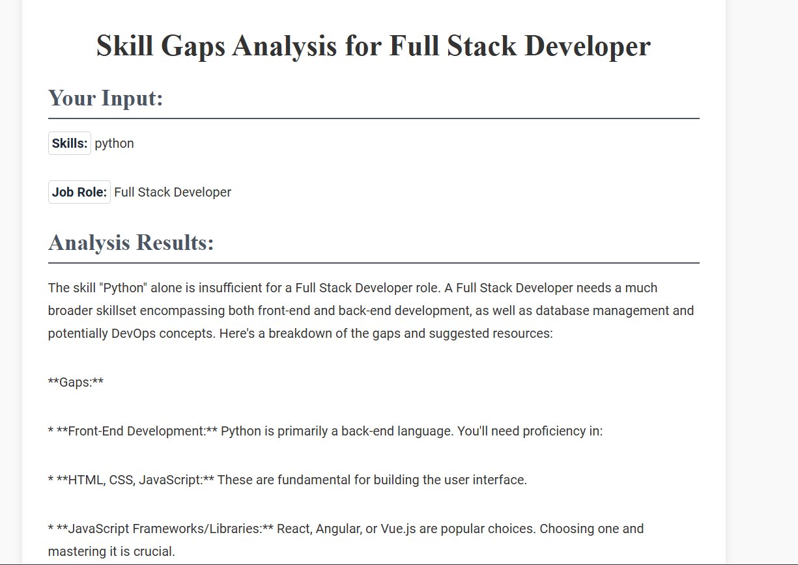
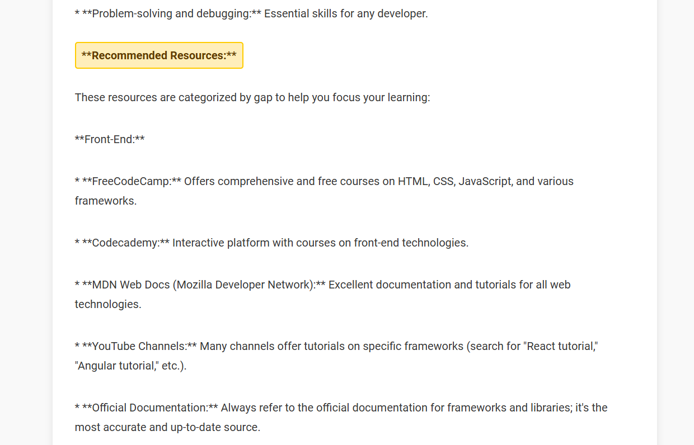

# Skill Gap Analyzer

Skill Gap Analyzer is a web-based tool that analyzes the skills of an individual against a specified job role, identifies skill gaps, and recommends learning resources to bridge these gaps.

---

## **Key Features**
- **Skill Analysis:** Compares user-provided skills with a selected job role.
- **Gap Identification:** Highlights the missing skills required for the job role.
- **Resource Recommendation:** Suggests online courses, books, and tools for learning the missing skills.
- **Interactive UI:** Light-themed, user-friendly interface for an enhanced user experience.
- **API Integration:** Utilizes the **Gemini API** for natural language processing to generate insights.

---

## **Tech Stack**
- **Frontend:**
  - React.js
  - HTML, CSS
  - JavaScript
- **Backend:**
  - Python (Flask)
  - Google Generative AI (Gemini API)
- **Database:**
  - N/A (API-driven application)
- **Additional Tools:**
  - Flask-CORS
  - dotenv for environment management
  - Git for version control

---

## **Gemini API Integration**
This project uses the Gemini API to process the skills and job role inputs.  
The API key is securely stored in an `.env` file and configured in the backend.

```python
from dotenv import load_dotenv
import os
import google.generativeai as genai

load_dotenv()
GEMINI_API_KEY = os.getenv("GEMINI_API_KEY")
genai.configure(api_key=GEMINI_API_KEY)
```

Ensure that the `.env` file contains the following:
```
GEMINI_API_KEY=your_api_key_here
```

---

## **How to Run**
1. Clone this repository.

2. Install dependencies.
  
3. Run the Flask backend.
   
4. Start the frontend.


## **Outputs**
Below are screenshots showcasing the application's functionality:



---

## **Functionalities**
- **User Input:** Users can input their current skills and desired job roles.
- **Data Processing:** The backend processes the inputs using the Gemini API to generate results.
- **Recommendations:** Suggestions include specific courses, tools, and books to learn missing skills.
- **Extensibility:** Can be extended to support more roles and skills.
